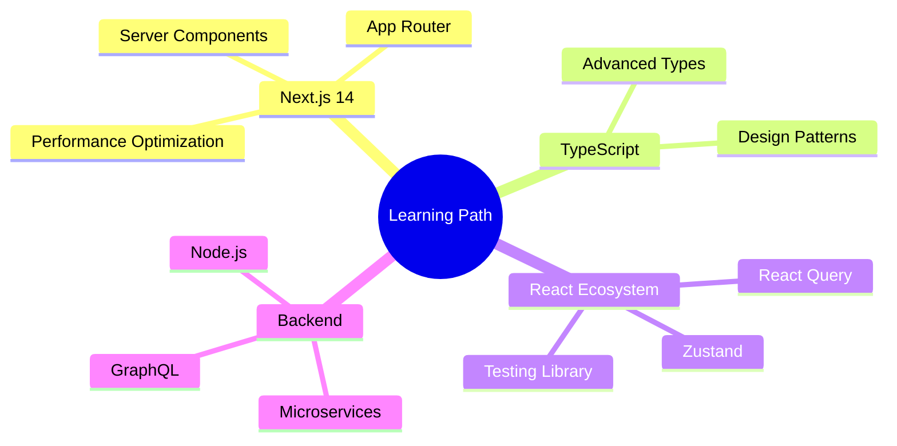

<div align="center">

# 👋 Hey there! I'm Aly Bihmama
### 🚀 Full-Stack Developer | Problem Solver | Continuous Learner


[](https://alywheng27.github.io/Portfolio/)
[](https://linkedin.com/in/alymamajr)
[](https://discord.gg/aly278380)

</div>

---

## 🎯 About Me

> *"When faced with something I don't know, I believe in being upfront about it, but I won't stop there."*

```typescript
const aly = {
    location: "Philippines 🇵🇭",
    role: "Full-Stack Developer",
    passion: ["Web Development", "UI/UX Design", "Problem Solving"],
    currentFocus: "Building scalable web applications with React & Next.js",
    philosophy: "Continuous learning and collaborative growth",
    askMeAbout: ["React", "TypeScript", "Laravel", "UI/UX Design"],
    funFact: "I love tackling complex problems and turning them into elegant solutions!"
};
```

I'm a **dedicated web developer** with a passion for creating seamless digital experiences. I thrive in collaborative environments where I can contribute to meaningful projects while continuously expanding my skillset. My approach combines technical expertise with creative problem-solving to deliver solutions that make a real impact.

---

## 🛠️ Tech Arsenal

<div align="center">

### Frontend Magic ✨


### Styling & UI 🎨


### Backend Power ⚡


### Mobile Development 📱


### Databases 🗄️


### Tools & Platforms 🔧


### Design & Creative 🎨


</div>

---

## 🚀 Featured Projects

<div align="center">

| Project | Description | Tech Stack | Live Demo |
|---------|-------------|------------|-----------|
| 🌟 **Portfolio Website** | Modern, responsive personal portfolio showcasing my work and skills | React, Next.js, TailwindCSS | [View Live](https://alywheng27.github.io/Portfolio/) |
| 🛒 **E-Commerce Platform** | Full-featured online store with admin panel | Laravel, MySQL, Bootstrap | Coming Soon |
| 📱 **Mobile App** | Cross-platform mobile application | React Native, TypeScript | In Development |
| 🎨 **Design System** | Reusable component library | React, Storybook, TailwindCSS | Coming Soon |

</div>

---

## 📊 GitHub Analytics

<div align="center">
  
  
</div>

<div align="center">
  
</div>

---

## 🎯 Current Focus

<div align="center">



</div>

- 🔥 **Currently Learning**: Next.js 14 App Router & Server Components
- 🎯 **Next Goal**: Master GraphQL and microservices architecture
- 📚 **Reading**: "Clean Code" by Robert C. Martin
- 🚀 **Building**: A SaaS platform with Next.js and Supabase

---

## 🌟 Let's Connect!

<div align="center">

I'm always excited to collaborate on interesting projects or discuss new technologies!

[](https://alywheng27.github.io/Portfolio/)
[](https://linkedin.com/in/alymamajr)
[](https://discord.gg/aly278380)
[](https://instagram.com/alybihmama)
[](https://facebook.com/aly.bihmama.3)

### 💬 Open to:
- 🤝 Collaboration on interesting projects
- 💡 Discussing new technologies and ideas
- 🎯 Freelance opportunities
- 📚 Knowledge sharing and mentoring

</div>

---

<div align="center">

### ⚡ Fun Fact
*I believe every bug is just a feature waiting to be discovered! 🐛➡️✨*


</div>

---

<div align="center">
  
</div>
